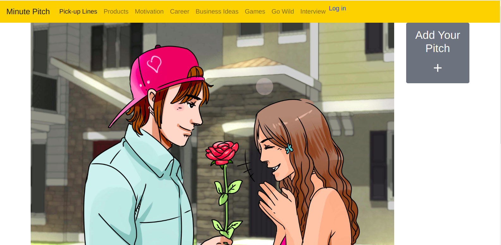
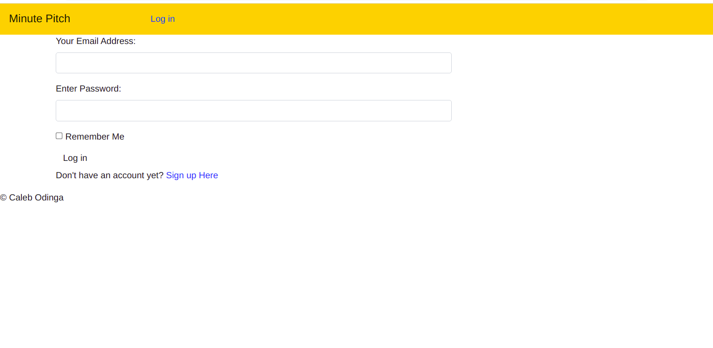
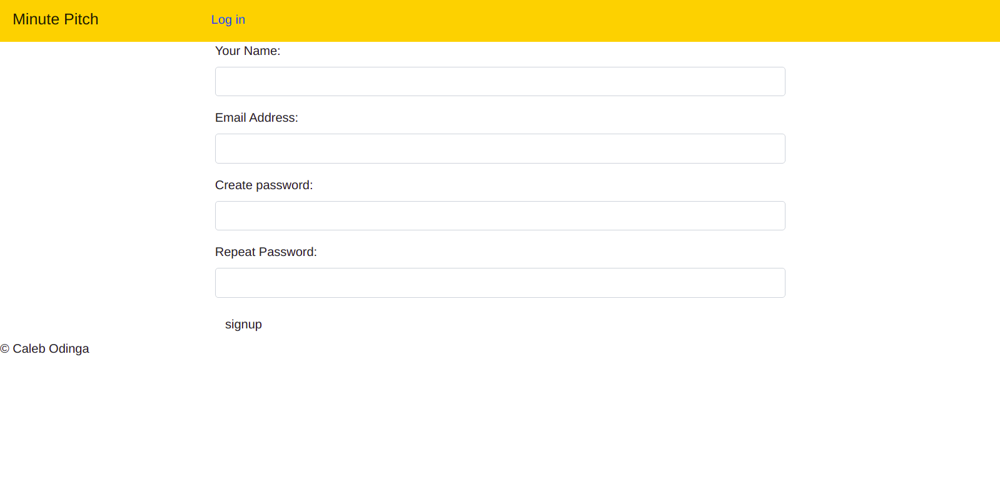
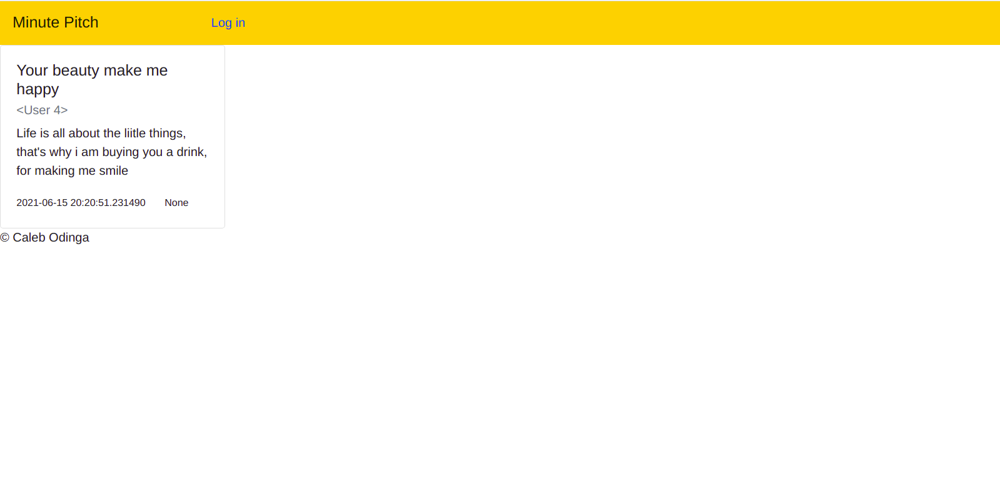
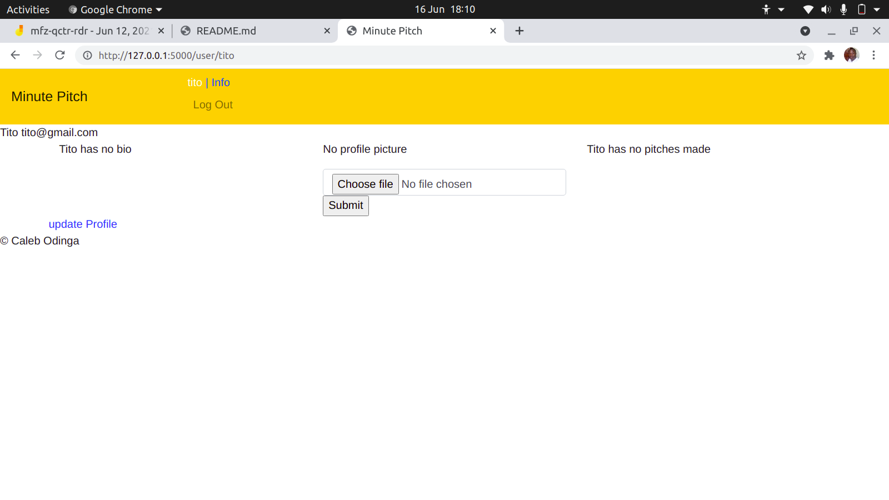

# A_Minute_Pitch
This is a website that shows one minute pitches to improve your first impression.

# User journey.
A user visits the site.
|_A user sees pitches categories on Homepage.
|_A user logs in with an existing account, or signs up
|__A user updates their account information by adding bio and photo
|_A user selects a category to view pitches.
|__A user views pitches and who added it
|-A user logs  out

# Features to add
Comments on pitches
Votes on pitches

# Output
A user selects a category and views pitches.

A user receives an welcoming email when they sign up

# Homepage

# Website pages

 
Login page

Register

Pitches page

User info

## Installation
For correct version requirements installation, check the requirements.txt

Have Python installed in you machine.- the version used for this project is 3.8.5

install pip

install and activate virtual environment

install flask in the virtual environment
  < version used flask1.0.2 >

Use git, Github and any editor or IDE to see the codes and the rendered frontend.

The execution is done in terminal. Either computer Terminal or IDE terminal

## Usage

Ensure you have Python installed in your machine. Clone this github repository, git pull to your local machine and code away.

## Contributing
Pull requests are welcome. For major changes, please open an issue first to discuss what you would like to change.

Please make sure to update tests as appropriate.

## Website's link
This aplication is hosted heroku. Website Link is 

## License
This Website uses MIT LICENSE. For more Read License.

Copyright (c) 2021 Caleb Odinga